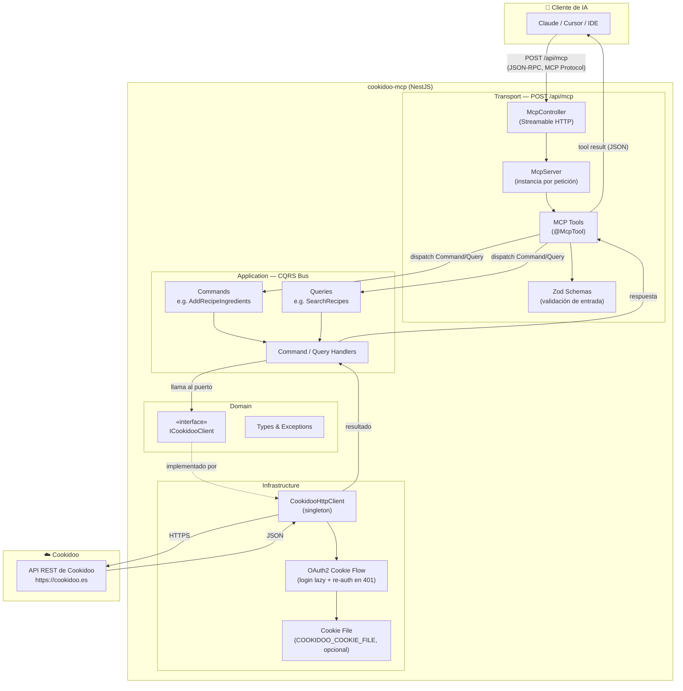
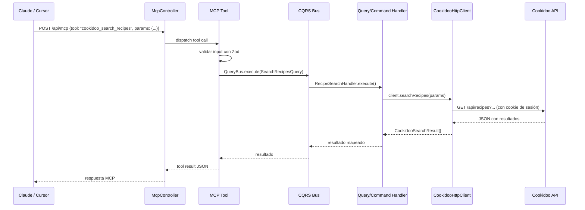
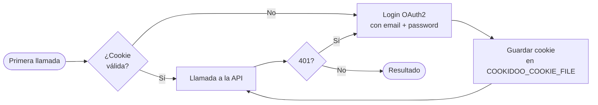
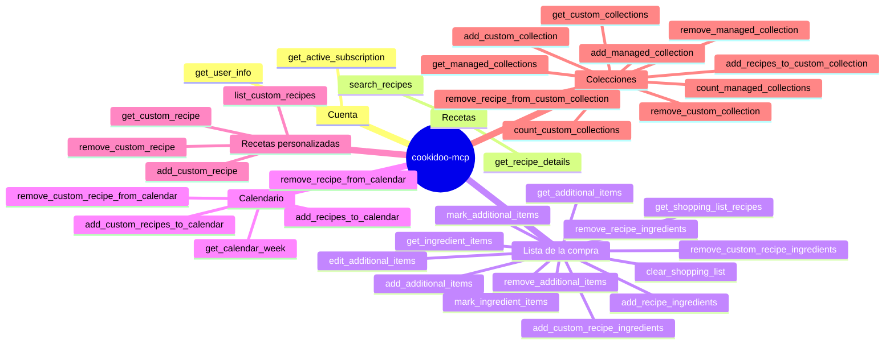

# cookidoo-mcp — Arquitectura y flujo de comunicación

## Visión general

`cookidoo-mcp` es un servidor [MCP (Model Context Protocol)](https://modelcontextprotocol.io) que conecta herramientas de IA (Claude, Cursor, etc.) con tu cuenta de Cookidoo. Recibe llamadas MCP del cliente de IA y las traduce en peticiones HTTP reales a la API de Cookidoo.

---

## Diagrama de comunicación

---

## Flujo de una petición paso a paso

---

## Capas de la arquitectura

| Capa | Ubicación | Responsabilidad |
|---|---|---|
| **Transport** | `src/core/mcp/transport/` | Recibe peticiones HTTP, construye un `McpServer` por petición, registra las tools |
| **MCP Tools** | `src/contexts/cookidoo/transport/mcp/tools/` | Una clase por tool, valida con Zod y despacha al bus |
| **Application** | `src/contexts/cookidoo/application/` | Commands y Queries CQRS; los handlers llaman al puerto |
| **Domain** | `src/contexts/cookidoo/domain/` | Tipos, excepciones, la interfaz `ICookidooClient` (puerto) |
| **Infrastructure** | `src/contexts/cookidoo/infrastructure/` | `CookidooHttpClient`: implementación concreta del puerto, gestiona la sesión OAuth2 |

---

## Autenticación con Cookidoo

El cliente es un **singleton**: guarda la sesión en memoria y, si se configura `COOKIDOO_COOKIE_FILE`, la persiste en disco entre reinicios. Un `401` de la API dispara automáticamente un nuevo login sin que el llamador tenga que hacer nada.

---

## Tools disponibles por dominio

