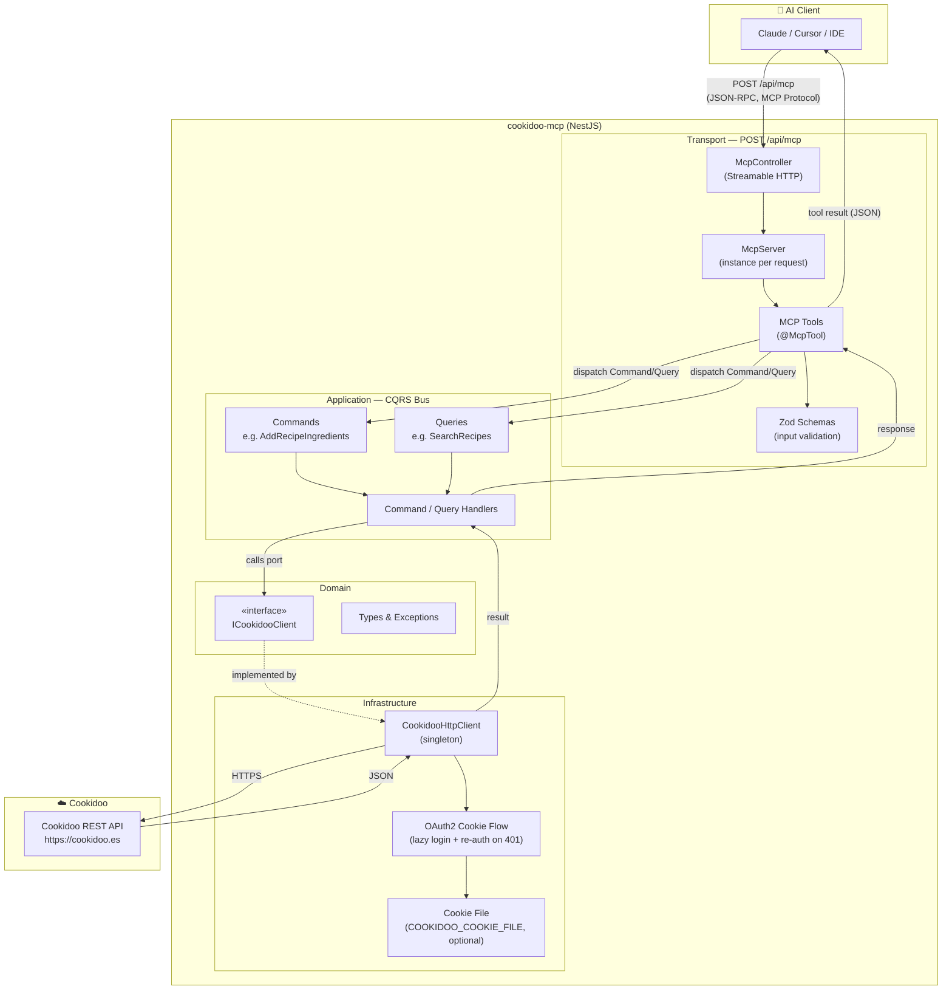
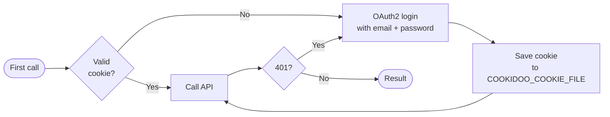
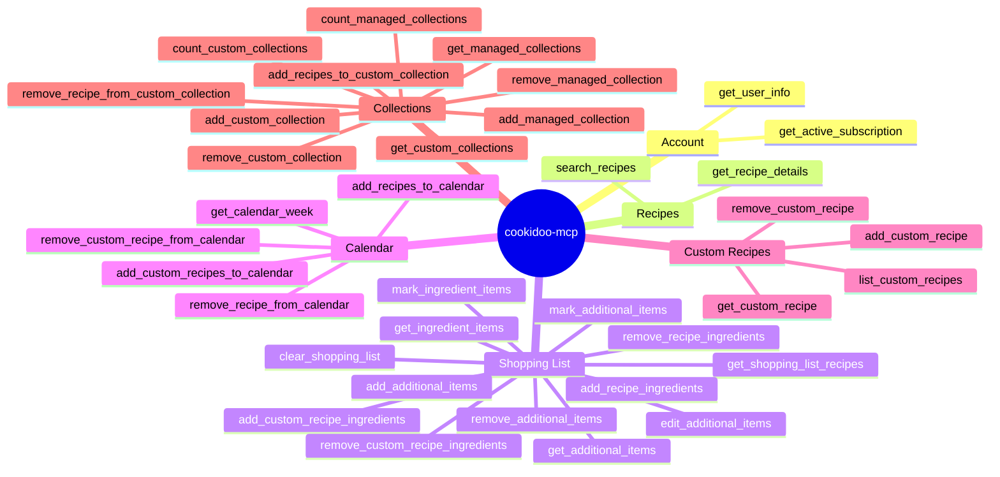

# cookidoo-mcp — Architecture & Communication Flow

## Overview

`cookidoo-mcp` is an [MCP (Model Context Protocol)](https://modelcontextprotocol.io) server that connects AI tools (Claude, Cursor, etc.) to your Cookidoo account. It receives MCP calls from the AI client and translates them into real HTTP requests to the Cookidoo API.

---

## Communication diagram

---

## Step-by-step request flow

---

## Architecture layers

| Layer | Location | Responsibility |
|---|---|---|
| **Transport** | `src/core/mcp/transport/` | Receives HTTP requests, builds one `McpServer` per request, registers tools |
| **MCP Tools** | `src/contexts/cookidoo/transport/mcp/tools/` | One class per tool — validates with Zod and dispatches to the bus |
| **Application** | `src/contexts/cookidoo/application/` | CQRS Commands & Queries; handlers call the port |
| **Domain** | `src/contexts/cookidoo/domain/` | Types, exceptions, the `ICookidooClient` interface (port) |
| **Infrastructure** | `src/contexts/cookidoo/infrastructure/` | `CookidooHttpClient`: concrete port implementation, manages the OAuth2 session |

---

## Cookidoo authentication flow

The client is a **singleton**: it keeps the session in memory and, when `COOKIDOO_COOKIE_FILE` is set, persists it to disk across restarts. A `401` from the API automatically triggers a new login — callers never deal with sessions.

---

## Available tools by domain

